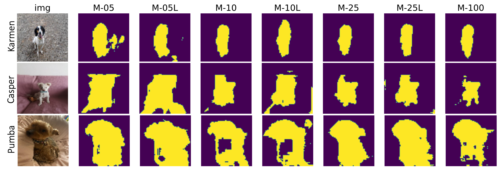

# Mean Teacher: Semi-Supervised Learning

## Project Description

UCL Module Project: Applied Deep Learning (COMP0197)

Date: April 2023

Examining the performance of the semi-supervised learning algorithm, Mean Teacher, for image semantic segmentation task on the Oxford Pet III dataset, through two experiments. 

- Experiment 1: A model was trained on 25% labeled and 75% unlabelled data using Mean Teacher, aiming to study (i) how its performance improves with more (epochs) training and (ii) how its performance compares to supervised only training models. 

- Experiment 2: Two models were trained on 5%/95% and 10%/90% labeled/unlabelled splits, using Mean Teacher, with the objective to understand (iii) how reducing the number of labeled data in Mean Teacher models, affects their performance.



## Setup

### Setting up a virtual environment
First, clone the repository:

```bash
git clone https://github.com/ezermoysis1/mean-teacher-ssl
```

Change your directory to where you cloned the files:

```bash
cd mean-teacher-ssl
```

Create a virtual environment with Python 3.6 or above:

```bash
virtualenv venv --python=python3.7 (or python3.7 -m venv venv or conda create -n multiqa python=3.7)
```

Activate the virtual environment. You will need to activate the venv environment in each terminal in which you want to use the project.

```bash
source venv/bin/activate (or source venv/bin/activate.csh or conda activate multiqa)
```

Install the required dependencies:

```bash
pip install -r requirements.txt
```
    
## Use the code

### Train

To train a model with with L = 25% labelled and (1-L) = 75% unlabelled data (referred to as 'M-25' in the report) use the following script. This also trains two benchmark supervised models only, with L% labelled data (referred to as 'M25L' or 'M-25L' in the report, and 100% data respectively ('MU' or M-100'). 

```bash
python main_pt.py 0.25
```

To train models with different labelled/unlabelled data splits, change the float after the .py. For example to train a L=35% and the two benchmark models, use the following

```bash
python main_pt.py 0.35
```

### Evaluation 

To evaluate all of the trained models run the following:

```bash
python main_pt.py evaluate
```
## Screenshots


## Authors

- [@ezermoysis1](https://github.com/ezermoysis1)


## Documentation
Please read the full report of the project [here](https://drive.google.com/file/d/1zX3HGt0AiCVF5MfM4lKS9Ag_boOhq-_c/view?usp=sharing)

